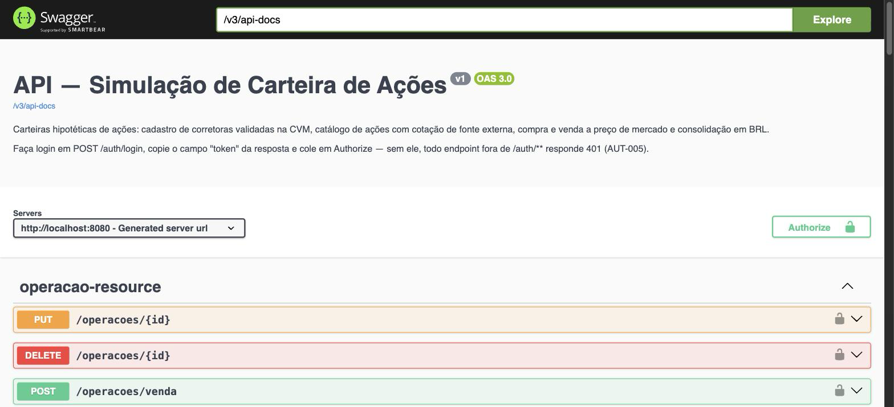
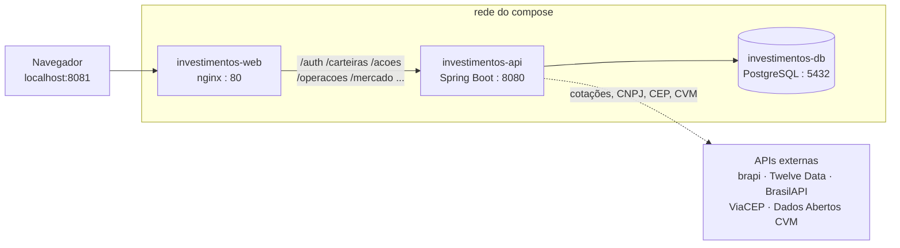
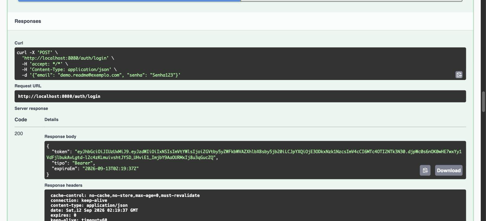
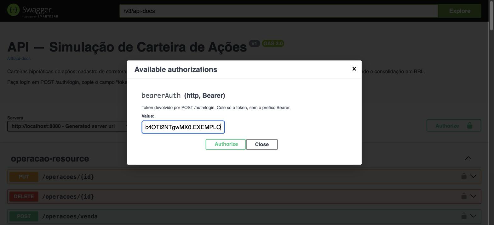
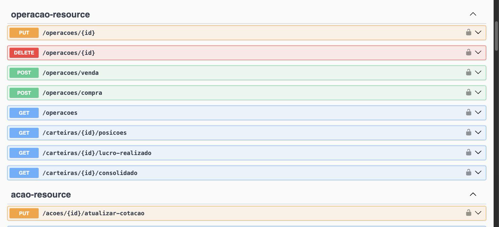

# api-externa-backend-v1

API REST do **Simulador de Carteira de Ações**: o investidor monta carteiras
hipotéticas, registra compras e vendas a preço de mercado e acompanha o resultado.
Nada de dinheiro real — não há saldo, depósito, ordem enviada a corretora nem
custódia.

O que o backend faz de fato é costurar **cinco fontes externas** (Receita, ViaCEP,
CVM, brapi e Twelve Data) num modelo próprio, com regra de negócio, autorização por
JWT e resultado consolidado numa moeda só.



---

## Stack

| Camada | O que é usado |
|---|---|
| Linguagem | Java 21 |
| Framework | Spring Boot 3.3 — Web, Data JPA, Validation, Security |
| Autenticação | JWT (jjwt) com filtro próprio, BCrypt nas senhas |
| Clientes HTTP | OpenFeign — um cliente por fonte externa |
| Banco | PostgreSQL 16, migrações versionadas com Flyway (16 até aqui) |
| Documentação | SpringDoc OpenAPI (Swagger UI) |
| Mapeamento | MapStruct + Lombok |
| Testes | JUnit 5, Mockito, MockMvc, H2 em memória — 233 testes em 28 classes |
| Empacotamento | Docker multi-stage — Maven compila, JRE roda |

---

## Como rodar

### Com Docker (sobe o sistema inteiro)

O `docker-compose.yml` deste repositório sobe **banco, API e frontend** juntos. O
frontend é construído a partir do repositório vizinho — o caminho vai em
`FRONTEND_PATH`, para não obrigar ninguém a repetir a minha organização de pastas.

```bash
git clone git@github.com:lucassm-dev/api-externa-backend-v1.git
cd api-externa-backend-v1
cp .env.example .env        # preencha as chaves e confira FRONTEND_PATH
docker compose up --build
```

| Endereço | O que é |
|---|---|
| http://localhost:8081 | Frontend (nginx) |
| http://localhost:8080/swagger-ui.html | Swagger UI |
| http://localhost:8080/v3/api-docs | Documento OpenAPI cru |
| localhost:5432 | PostgreSQL |

Como as três peças se enxergam:



O SPA e a API respondem na **mesma origem**: o nginx repassa os prefixos da API
para `backend:8080`. É por isso que não existe URL base configurada no Angular e o
CORS some do problema em vez de virar configuração por ambiente.

A porta 8080 fica exposta só para o Swagger e para chamadas diretas em
desenvolvimento — o frontend não passa por ela.

### Só o banco, com a API pelo Maven

Modo do dia a dia de quem está mexendo no backend: recompilar não exige rebuild de
imagem.

```bash
docker compose up -d postgres
./mvnw spring-boot:run
```

O perfil `dev` aponta o datasource para `localhost` e o Flyway roda as migrações no
arranque.

### Variáveis de ambiente

Tudo vem do `.env` (carregado pelo `spring-dotenv` fora do container, e pelo
compose dentro dele). Nenhuma chave é rastreada pelo git.

| Variável | Para que serve | Obrigatória |
|---|---|---|
| `POSTGRES_DB` / `POSTGRES_USER` / `POSTGRES_PASSWORD` | Banco | sim |
| `POSTGRES_PORT` | Porta publicada do Postgres (padrão 5432) | não |
| `JWT_SECRET` | Assinatura do token — gere com `openssl rand -base64 48` | sim |
| `BRAPI_TOKEN` | Cotação de ações BR | sim¹ |
| `TWELVEDATA_API_KEY` | Cotação de ações US | sim¹ |
| `FRONTEND_PATH` | Onde está o repo do frontend, para o compose construir a imagem | só no compose |
| `BACKEND_PORT` / `FRONTEND_PORT` | Portas publicadas (8080 / 8081) | não |
| `CORS_ALLOWED_ORIGINS` | Origens externas autorizadas. Vazio é o normal — o frontend fala pela mesma origem | não |

¹ A brapi libera `PETR4`, `VALE3`, `ITUB4` e `MGLU3` sem token, o que basta para
passear pelo sistema. Sem as chaves, o resto das ações cai no caminho de
degradação (último valor conhecido + aviso), não em tela de erro.

---

## Como testar a API

Duas portas de entrada: o **Swagger**, para experimentar um endpoint isolado, e o
**`api-requests.http`**, para percorrer o sistema inteiro na ordem certa.

### Pelo Swagger

Todo endpoint fora de `/auth/**` exige token. O fluxo é sempre o mesmo:

**1. Cadastre e faça login.** `POST /auth/cadastro`, depois `POST /auth/login`.
A resposta traz o `token`:



**2. Cole o token em `Authorize`** (canto direito, acima da lista). Só o token,
sem o prefixo `Bearer` — o Swagger monta o cabeçalho:



**3. Os cadeados fecham** e todos os endpoints passam a viajar autenticados:



Sem esse passo, qualquer endpoint protegido responde **401 AUT-005** — que, aliás,
é o primeiro teste de erro do roteiro.

### Pelo `api-requests.http`

Na raiz do repositório há um **roteiro de testes manuais** de 581 linhas, cobrindo
SPEC-01 a SPEC-09. Cada bloco diz o que testa e qual status e código de erro
esperar. Roda direto no IntelliJ IDEA (HTTP Client, nativo) ou no VS Code com a
extensão **REST Client** — é só clicar no `▶` ao lado do bloco.

<!-- Captura do roteiro aberto no IDE: salve em docs/screenshots/http-client.png e descomente a linha abaixo.

-->

No topo do arquivo ficam as variáveis a preencher conforme as respostas chegam:

```http
@baseUrl = http://localhost:8080
@token = COLE_AQUI_O_TOKEN_APOS_O_LOGIN
@corretoraId = 1
@carteiraId = 1
@acaoId = 1
```

**Rode em ordem** — cada seção depende dos ids criados na anterior:

| Seção | O que exercita | Depende de |
|---|---|---|
| 1. Autenticação | cadastro, login, e-mail/CPF duplicado, senha fraca, token ausente e corrompido | — |
| 2. Investidor | listagem, busca por id, id inexistente | login (token) |
| 3. Corretora | cadastro com CNPJ real validado na Receita e na CVM, duplicidade, busca por CNPJ | 1 |
| 4. Carteira | criação vinculada à corretora, renomear, carteira de outro dono | 3 |
| 5. Ação | cadastro BR e US com cotação da fonte, ticker duplicado, ticker inexistente | 4 |
| 6. Operação | compra, venda, venda sem posição, edição com recálculo em cascata, posições, lucro realizado, consolidado | 5 |
| 7. Mercado | barra de cotações e o cache de 15 min na segunda chamada | 1 |
| 8. Limpeza | exclusões na ordem inversa da dependência | todas |

A ordem não é decoração: a corretora não pode ser excluída com carteira ativa
(**422 COR-004**), a carteira não pode ser excluída com posição aberta
(**422 CAR-002**), e ação só pode ser cadastrada por quem já tem carteira
(**409 ACA-004**). O roteiro passa de propósito por cada uma dessas paredes.

### Contrato de erro

Todo erro sai no mesmo formato, com um código próprio por domínio — nunca só a
mensagem, que muda de texto sem aviso ([ADR-009](docs/adr/009-contrato-unico-de-erro-com-codigo-por-dominio.md)):

```json
{
  "timestamp": "2026-09-12T02:16:34Z",
  "status": 401,
  "codigo": "AUT-004",
  "error": "Unauthorized",
  "message": "E-mail ou senha inválidos.",
  "path": "/auth/login"
}
```

| Prefixo | Domínio | Exemplos |
|---|---|---|
| `AUT` | Acesso e identidade | `AUT-004` credenciais inválidas · `AUT-005` sem token · `AUT-006` token expirado · `AUT-008` senha fora da política |
| `COR` | Corretora | `COR-002` CNPJ duplicado · `COR-003` CNPJ inválido ou fora da Receita/CVM · `COR-004` tem carteira ativa |
| `CAR` | Carteira | `CAR-001` não encontrada ou de outro dono · `CAR-002` tem posição ativa |
| `ACA` | Ação | `ACA-002` ticker duplicado · `ACA-003` tem posição ativa · `ACA-004` investidor sem carteira |
| `OPE` | Operação | `OPE-003` venda sem posição · `OPE-004` venda acima da posição · `OPE-005` preço com mais de 2 casas |
| `EXT` | Fonte externa | `EXT-008` ticker inexistente · `EXT-009` fonte indisponível · `EXT-010` cota excedida · `EXT-011` câmbio indisponível |
| `VAL` | Payload | `VAL-001` — acompanha `fieldErrors` com campo e motivo |

Note o que o `AUT` **não** faz: carteira de outro investidor responde **404
CAR-001**, nunca 403. Dizer "existe, mas não é sua" já é vazar informação.

### Testes automatizados

```bash
./mvnw test
```

233 testes, H2 em memória — não precisa do Postgres no ar. Cada critério de aceite
da especificação vira um teste anotado com `@spec:AC-xxx` no título, e é isso que
permite auditar a spec contra o código em vez de confiar nela.

---

## Endpoints

| Recurso | Método e rota |
|---|---|
| Acesso | `POST /auth/cadastro` · `POST /auth/login` |
| Investidor | `GET /investidores` · `GET /investidores/{id}` · `DELETE /investidores/{id}` |
| Corretora | `POST /corretoras` · `GET /corretoras` · `GET /corretoras/{id}` · `GET /corretoras/cnpj/{cnpj}` · `DELETE /corretoras/{id}` |
| Carteira | `POST /carteiras` · `GET /carteiras` · `PATCH /carteiras/{id}` · `DELETE /carteiras/{id}` |
| Posição e resultado | `GET /carteiras/{id}/posicoes` · `GET /carteiras/{id}/lucro-realizado` · `GET /carteiras/{id}/consolidado` |
| Ação | `POST /acoes` · `GET /acoes` · `GET /acoes/ticker/{ticker}` · `PUT /acoes/{id}/atualizar-cotacao` · `DELETE /acoes/{ticker}` |
| Operação | `POST /operacoes/compra` · `POST /operacoes/venda` · `GET /operacoes` · `PUT /operacoes/{id}` · `DELETE /operacoes/{id}` |
| Mercado | `GET /mercado/barra-cotacoes` |

Exclusão é **lógica** em todo o sistema: o registro sai das listagens e libera a
chave natural para um cadastro novo, mas continua no banco sustentando o histórico
([ADR-007](docs/adr/007-exclusao-logica-com-bloqueio-por-vinculo-ativo.md)).

---

## APIs externas e limitações

| Fonte | Uso | Plano gratuito | Atraso da cotação |
|---|---|---|---|
| BrasilAPI | Dados cadastrais por CNPJ | Sem chave, sem cota publicada | — |
| ViaCEP | Endereço por CEP | Sem chave | — |
| Dados Abertos CVM | Autorização da corretora (`cad_intermed.zip`) | Público | Base do último dia útil |
| brapi.dev | Cotação de ações BR | 15.000 requisições/mês | ~30 minutos |
| Twelve Data | Cotação de ações US | 800 créditos/dia (8/min) | ~0,3 a 2 minutos após o fechamento do candle |
| AwesomeAPI / PTAX BCB | Câmbio USD-BRL | Público | Diário |

Três consequências que atravessam o sistema inteiro:

1. **A cotação não é ao vivo.** Toda resposta vem com `dataHoraCotacao`, e o valor
   fica em cache por 15 minutos (RN-Q01, [ADR-005](docs/adr/005-cotacao-como-snapshot-com-cache.md)).
2. **Fonte que cai não derruba a tela.** A resposta vem com o último valor conhecido
   e um aviso, não com erro ([ADR-006](docs/adr/006-degradacao-com-avisos-em-vez-de-falha.md)).
3. **Cota estourada tem código próprio** (`EXT-010`), separado de indisponibilidade
   (`EXT-009`) — são problemas diferentes e pedem reações diferentes.

---

## Estrutura

```
src/main/java/com/apiexternabackend/
  resources/     controllers REST + GlobalExceptionHandler
  services/      regra de negócio
  repositories/  Spring Data JPA
  domains/       entidades, DTOs e enums
  mappers/       MapStruct
  infra/
    client/      clientes Feign, um por fonte externa
    adapter/     traduz a resposta da fonte para o modelo do domínio
    facade/      escolhe a fonte (BR ou US) e trata degradação
  config/        segurança, JWT, Feign, OpenAPI
src/main/resources/db/migration/   migrações Flyway
```

A camada `infra` existe para isolar a fonte externa: trocar a brapi por outro
provedor de cotação mexe em `client` e `adapter`, e não encosta em `services`.

---

## Como este projeto é desenvolvido

O repositório é **spec-anchored**: a especificação é auditada mecanicamente contra
o código, não confiada. Em `.spec/features/` moram as features, cada uma com
histórias, critérios de aceite e tarefas rastreadas até o teste.

```bash
node .claude/skills/onp-spec-driven/scripts/onp-spec.mjs audit --ci
```

Decisões de arquitetura ficam em [`docs/adr/`](docs/adr/) — dez ADRs cobrindo
sessão por token de prazo fixo, catálogo compartilhado, consolidação em moeda
única, snapshot de cotação, degradação com avisos, exclusão lógica e contrato de
erro. Requisitos de produto em [`docs/prd/`](docs/prd/).

---

## Frontend

Este repositório é só a API. A interface vive em
[api-externa-frontend-v2](https://github.com/lucassm-dev/api-externa-frontend-v2)
— Angular 22, componentes standalone, signals, gráficos em SVG próprio.

---

## Autor

**Lucas Mendes** — [@lucassm-dev](https://github.com/lucassm-dev)
